# Hotel Booking System with Django

## Introduction

Welcome to my fourth milestone project. In this project, I have created a hotel booking system where users can register an account, book a room, and manage their bookings.  
It will use the Django framework, Python, HTML, and JavaScript languages.

This project aims to show the use of CRUD functionality (Create, Read, Update, Delete). After registering an account, the user can create, read, update and delete their hotel booking.

A live website can be found [here](https://my-hotel-project.herokuapp.com/).


## Table of Contents

- [1 UX](#1-ux)
  - [Strategy](#strategy)
    - [Project Goals](#project-goals)
    - [User Goals](#user-goals)
    - [User Expectations](#user-expectations)
    - [User Stories](#user-stories)
    - [Scope](#scope)
      - [Phase 1](#phase-1)
      - [Phase 2](#phase-2)
  - [Structure](#structure)
    - [Data Model](#data-model)
  - [Wireframes](#wireframes)
    - [Mobile](#mobile)
    - [Desktop](#desktop)
  - [Surface](#surface)
    - [Colours](#colours)
    - [Typography](#typography)
- [2 Features](#2-features)
  - [All Pages](#all-pages)
  - [Home Page](#home-page)
  - [Our Rooms Page](#our-rooms-page)
  - [Book Now Page](#book-now-page)
  - [My Bookings Page](#my-bookings-page)
  - [Register page](#register-page)
  - [Sign in/out](#sign-in/out)
- [3 Technologies Used](#3-technologies-used)
- [4 Testing](#4-testing)
  - [Chrome DevTools](#chrome-devtools)
  - [Responsive Tools](#responsive-tools)
  - [W3C Validator Tools](#w3c-validator-tools)
  - [JavaScript](#javascript)
  - [Python](#python)
  - [Manual Testing](#manual-testing)
- [5 Development Cycle](#5-development-cycle)
  - [Project Checklist](#project-checklist)
- [6 Deployment](#6-deployment)
- [7 End Product](#7-end-product)
- [8 Know Bugs](#8-known-bugs)
- [9 Credits](#9-credits)

## 1 UX

[Go to the top](#table-of-contents)

Travelling is by far the thing that I like to do most, and a big part of any trip is about the accommodation you choose to stay in.
When you visit a new city, you need a place to stay, and nowadays the easiest way to book a hotel room is online.

This project will demonstrate how simple and easy a hotel booking system can be.

## Strategy

[Go to the top](#table-of-contents)

### Project Goals

[Go to the top](#table-of-contents)

This project aims to allow users to register a new account, perform a sign-in and sign-out action, book a hotel room, and manage their bookings (see past and future bookings, make an update on an upcoming booking, or cancel the booking).

### User Goals

[Go to the top](#table-of-contents)

First Time Visitor Goals

- As a first-time visitor, I want to book a room for a chosen date.
- As a first-time visitor, I want to view pictures of the hotel room and prices per night.
- As a first-time visitor, I want to view information about the hotel so I can decide to book a room.
- As a first-time visitor, I want to get the hotel's contact information.

Returning Visitor Goals

- As a Returning Visitor, I want to view my booking details.
- As a Returning Visitor, I want to update an upcoming booking.
- As a Returning Visitor, I want to cancel an upcoming booking.

Frequent User Goals

- As a Frequent User, I want to see my past bookings or book a new stay.

### User Expectations

[Go to the top](#table-of-contents)

 The following user expections were considered while designing the site:

- The menu is clear to read and easy to navigate.
- The site structure is designed to be simple and easy to use.
- The user interface is easy to navigate.
- The website is responsive on all devices.
- All images on the website are of high quality.
- Easy to find contact information and hotel location.

### User Stories

[Go to the top](#table-of-contents)

I used GitHub kanban board to log all user stories for my project. It was an excellent tool to visualize what to focus on first.
The user stories would go directly to the "To Do" lane when created. I would move them to the "In progress" lane when working on the story, and once completed, I would move them to the "Done" lane.


### Scope

[Go to the top](#table-of-contents)

I decided to divide this project into two phases. I included the features that I have identified as a minimum viable product in the first phase.
In the second, I included the features that I thought would make a good improvement for the web application.

### Phase 1

[Go to the top](#table-of-contents)

- Display pictures of the hotel rooms
- Display hotel information, including location and contact
- Allow users to register a new account
- Responsive design
- Ability to create a booking
- Ability to update a booking
- Ability to cancel a booking
- Display past bookings
- Display alerts for each step of CRUD operations

### Phase 2

[Go to the top](#table-of-contents)

- Register account email confirmation
- Email confirmation for new bookings
- Create a new Django view to confirm booking deletion instead of using a JavaScript function
- Calculate the total price of the booking and display it to the user
- A button on the "Update booking" page to go back to "My Bookings" page if the user changes their mind.

## Structure

[Go to the top](#table-of-contents)

- All pages of this project are responsive using different screen sizes. In addition, fonts and color scheme are consistent throughout all pages, guaranteeing the best user experience.
- Navbar is positioned at the top, and Footer at the bottom of all pages.
- Buttons have self-describing text for easy navigation.

### Data Model

[Go to the top](#table-of-contents)

- Planned database structure:


- Final database structure:

```python
class Booking(models.Model):
    ''' Model for user bookings '''
    today = date.today()
    user = models.ForeignKey(
        User, on_delete=models.CASCADE, related_name="user_bookings")
    created_on = models.DateTimeField(auto_now_add=True)
    number_of_guests = models.PositiveIntegerField(
        default=1, validators=[MaxValueValidator(15), MinValueValidator(1)])
    check_in_date = models.DateField(default=date.today)
    number_of_nights = models.PositiveIntegerField(
        default=1, validators=[MaxValueValidator(30), MinValueValidator(1)])
    TYPE_OF_ROOM_CHOICES = [
        ('Twin', 'Twin Room'),
        ('Double', 'Double Room'),
        ('Family', 'Family Room'),
    ]
    type_of_room = models.CharField(
        max_length=15,
        choices=TYPE_OF_ROOM_CHOICES,
        blank=False,
        default='Double'
        )

    ''' Display objects using the check-in date'''
    def __str__(self):
        return str(self.check_in_date)

    class Meta:
        """ Meta class used for organizing bookings by check-in date """
        ordering = ['check_in_date']
```

## Wireframes

[Go to the top](#table-of-contents)

### Mobile

Home Page mobile:


Our Rooms Page mobile:


My Bookings Page mobile:


Book Now Page mobile:


Sign in/out and Register Page mobile:


### Desktop

[Go to the top](#table-of-contents)

Only the index page and my bookings page have a difference in design compared to the mobile version.

Index Page desktop top:

The index page has a bigger hero image covering most of the page, a margin on both sides of the page, and the hotel info is displayed on top of the hero image.


Index Page desktop bottom:


My Bookings Page desktop:

My bookings page displays booking cards in rows of up to four cards.


## Surface

[Go to the top](#table-of-contents)

### Colours

I used ColorSpace to generate this colour scheme.


The following colors were used to design this website:

- #E9DBC9
- #005B4B
- #e9dbc9c9
- #BCBEA9
- #f8f9fa

### Typography

[Go to the top](#table-of-contents)

I decided to use Google fonts "Karla" for all pages with "Sans Serif" as the backup font.

Google fonts link [here](https://fonts.google.com/specimen/Karla?query=karla)

## 2 Features

[Go to the top](#table-of-contents)

### All Pages

Navigation bar:

- Is placed at the top of the screen at all times
- If the user is logged in, the "Sign-in" link will change to "Sign out" and the "Register" link will disappear.
- The link in the navbar will have a class attribute to show as active when the user is the specific page. The "Home" and "Contact Us" links will be activated together as both links belong to the same page but in different sections.
- The restaurant logo works as a link for the home page.
- In the mobile version, the logo is positioned at the center of the navbar, and a hamburger icon is placed on the left.
- All links are displayed when the hamburger icon is clicked, as shown below.

Navbar Logged:


Navbar not Logged:


Navbar showing "Our Rooms" link active:


Navbar mobile:


Navbar hamburger icons mobile:


Footer:

- The footer is placed at the bottom of the screen at all times.
- It has three social links placed at the center of the page that opens in a new page.


### Home Page

[Go to the top](#table-of-contents)

- The Home page has a short description of the hotel and two action buttons.
- A button for booking a room and a button that will send the user to the "Our Rooms" page, where they can see information and pictures of the rooms.
- For larger screens the hotel information is displayed inside a container on top of the hero image to increase readability.


- Below the hero image, you can find an iframe containing the google maps location of the hotel.


- At the bottom of the page, you can find the hotel's contact information: address, email and phone number.


### Our Rooms Page

[Go to the top](#table-of-contents)

- On the "Our Rooms" page, you will find pictures of the three types of rooms the hotel has: Double Room, Twin Room and Family Room.
- Under each picture, there is the price per night for the room and a short description of the room.


### Book Now Page

[Go to the top](#table-of-contents)

- If the user is not logged in, a call for sign-in is displayed on the page.


On the "Book Now" page, the user will be asked to fill up a form with:


- Check-in date (date must be for the next day onwards)
- Number of nights (up to 30 nights)
- Number of guests (up to 15 guests)
- Type of room (Choose between double, twin or family rooms)
- When clicking the "Book Now" button the thank you page will be displayed.
- On the "thank you" page, the user can find a button to manage their bookings.


- An alert error message will show if the user inserts any invalid information.


### My bookings Page

[Go to the top](#table-of-contents)

- If the user is not logged in, a call for sign-in is displayed on the page.


On the "My bookings" page, the bookings are separated into two categories: Upcoming and Past.

- If the user has no bookings, a message is displayed instead of the cards.


- For upcoming bookings, the card will have two buttons at the bottom for updating and deleting the booking.
- The cards are ordered by the nearest check-in date.

Bookings will be displayed in rows of up to four cards, depending on the screen size.
Each booking is displayed on a card containing:

- Check-in date
- Number of Nights
- Room Type
- Number of Guests


- If the user clicks on the "Update" button, the "Update Booking" page will show containing a form to update the booking.


- An alert will show when the update is done.


- If the user clicks on the "Cancel" button, a JavaScript onclick function will be called, and a popup to confirm the cancellation will show.


- An alert will show when the cancelation is done.


### Register Page

[Go to the top](#table-of-contents)

On the registration page, the user will need to fill in a form containing:

- Username
- Email(optional)
- password
- password(again)


When clicking the sign-up button, two alerts will show.


This project doesn't have an e-mail confirmation management system yet. Because of this, the line of code below was added to settings.py.

```python
EMAIL_BACKEND = 'django.core.mail.backends.console.EmailBackend'
```

The e-mail confirmation is handled in the console, as seen below.


### Sign in/out

[Go to the top](#table-of-contents)

On the "Sign in" page, the user will need to fill up a form containing:

- Username
- Password


An alert will show once the sign-in is completed.


If the user clicks on the sign-out link in the navigation bar, the "Sign out" page will be displayed.


If the user confirms the sign-out, an alert will show.


## 3 Technologies Used

[Go to the top](#table-of-contents)

- [HTML5](https://en.wikipedia.org/wiki/HTML)
  - The project uses HyperText Markup Language.
- [CSS3](https://en.wikipedia.org/wiki/CSS)
  - The project uses Cascading Style Sheets.
- [Django 3.2](https://en.wikipedia.org/wiki/Django_(web_framework))
  - Django was used as the web framework to develop this project.
  - Below you can find the Django libraries and packages used in this project.
    - [Gunicorn](https://gunicorn.org/)
      - Used to run server on heroku
    - [Dj_database_url](https://pypi.org/project/dj-database-url/)
      - Utility to utilize the DATABASE_URL environment variable to configure Django application.
    - [Psycopg2](https://pypi.org/project/psycopg2/)
      - Library to connect to PostgreSQL
    - [Cloudinary](https://en.wikipedia.org/wiki/Cloudinary)
      - Library to host pictures on Heroku
    - [django-allauth](https://django-allauth.readthedocs.io/en/latest/installation.html)
      - Library used for authentication and registration
    - [django-crispy-forms](https://django-crispy-forms.readthedocs.io/en/latest/)
      - Library used to format forms in Django.
    - [WhiteNoise](http://whitenoise.evans.io/en/stable/)
      - Allows web app to serve its own static files.
- [JavaScript](https://en.wikipedia.org/wiki/JavaScript)
  - The project uses JavaScript.
- [Python](https://en.wikipedia.org/wiki/Python_(programming_language))
  - The project uses Python.
- [Boostrap 5](https://getbootstrap.com/docs/5.0/getting-started/introduction/)
  - The project uses Bootstrap 4.6.
- [Cloudinary](https://en.wikipedia.org/wiki/Cloudinary)
  - Cloudinary was used as cloud-based service to store the images used in this project.
- [PostgreSQL](https://www.postgresql.org/)
  - The project uses PostgreSQL as a database.
- [Gitpod](https://www.gitpod.io/)
  - The project uses Gitpod.
- [Chrome](https://www.google.com/intl/en_uk/chrome/)
  - The project uses Chrome to debug and test the source code using HTML5.
- [Balsamiq](https://balsamiq.com/)
  - Balsamiq was used to create the wireframes during the design process.
- [Canva](https://en.wikipedia.org/wiki/Canva)
  - Canva was used as the image provider for this project.
- [Google Fonts](https://fonts.google.com/)
  - Google fonts were used to import the "Karla" font into the style.css file which is used on all pages throughout the project.
  [Heroku](https://en.wikipedia.org/wiki/Heroku)
  - Heroku was useed as a cloud platform service for this project.
- [GitHub](https://github.com/)
  - GitHub was used to store the project's code after being pushed from Git.

## 4 Testing

[Go to the top](#table-of-contents)

### Chrome DevTools

[Go to the top](#table-of-contents)

I used the developer tools to debug my code and try different styles. When something in my code didn’t behave as I expected, I would inspect it and try out other solutions. Finally, when I was happy with the results, I would copy and paste the code into the project file.

### Responsive Tools

[Go to the top](#table-of-contents)

I used [Am I Responsive](http://ami.responsivedesign.is) in conjunction with Chrome DevTools to check how the website behaved in different screen sizes.

### W3C Validator Tools

[Go to the top](#table-of-contents)

#### HTML

I used [W3C Markup](https://validator.w3.org/) to check my code for any errors in the HTML pages.

- All pages were tested using the heroku live link
- I found an error within my index.html iframe.

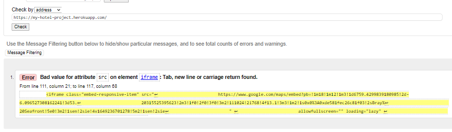

- This error was fixed by moving all the iframe src path to one single line.

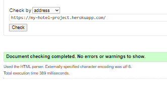

- All other template pages came back with no errors.

#### CSS

I used [W3C CSS Validation](https://jigsaw.w3.org/css-validator/#validate_by_input) to check my code for any errors in my style.css page.

I had no errors in my CSS file:
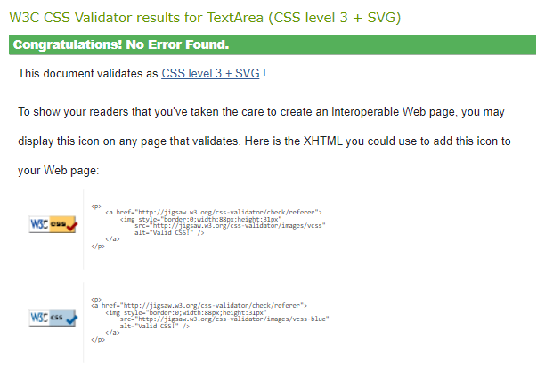

### JavaScript

[Go to the top](#table-of-contents)

I used [JS Hint](https://jshint.com/) to check for any errors in the base.html file JavaScript script tag. JS Hint showed warnings below:

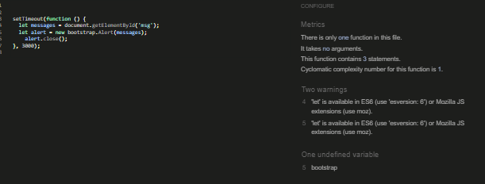

As these warnings were related to the esversion, they were ignored.

### Python

[Go to the top](#table-of-contents)

I used [PEP8 online](http://pep8online.com/) to check for errors within my Python files.

- views.py:

  Three errors were found in this file

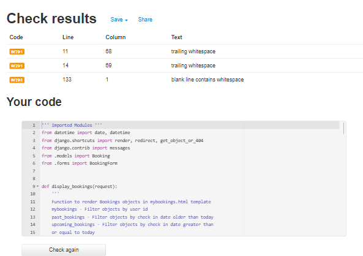

All errors were fixed by removing trailing space and whitespace from the specific lines.

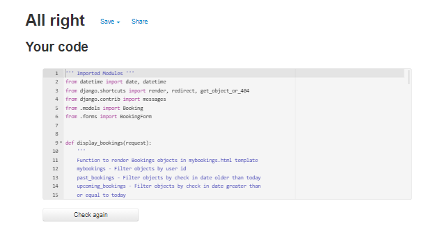

- settings.py:

  Multiple  "line too long" errors were found in this file

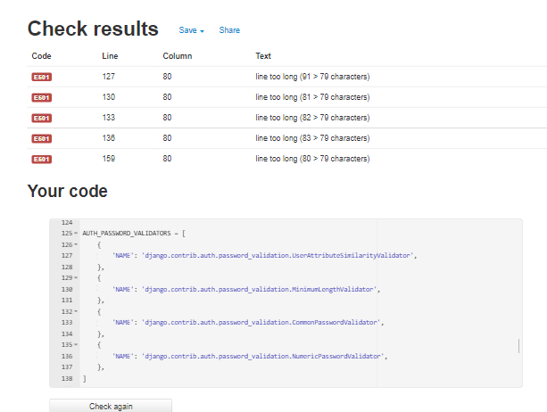

I decided to make no changes to the settings.py as the errors were in a critical part of the code.

- models.py:

  No errors were found

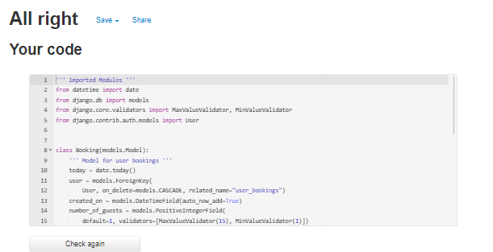

- forms.py:

  No errors were found

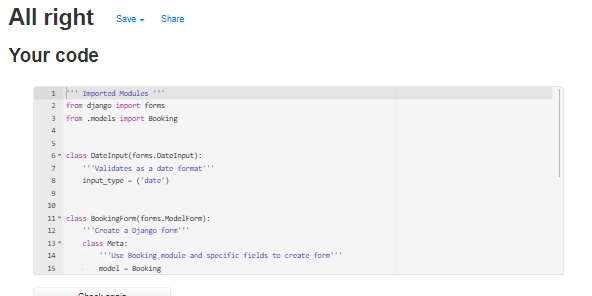

- urls.py

  No errors were found

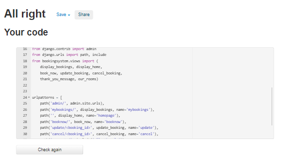

## Manual Testing

[Go to the top](#table-of-contents)

I have tested this website features in multiples screen sizes.

These include:

- Google Chrome
- Mozila Firefox
- Safari

The following test process was done on all pages using pc and mobile:

### Navigation Bar

- The navigation bar was tested on all pages.

TEST            | OUTCOME                          | PASS / FAIL  
--------------- | -------------------------------- | ---------------
Home page | When clicking the "Home" button in the navigation bar, the browser redirects me to the home page. The is-active styling class will be added to the nav-link making it display text in bold. | PASS
Logo | When clicking the "Logo" in the navigation bar, the browser redirects me to the home page. The logo is placed at the center of the navbar on small screens. All links in will placed in the hamburger menu in small screens | PASS
Contact Us | When clicking the "Contact Us" button in the navigation bar, the browser redirects me to the contact us section on the page. The is-active styling class will be added to the nav-link making it display text in bold. | PASS
Our Rooms | When clicking the "Our Rooms" button in the navigation bar, the browser redirects me to the our rooms page. The is-active styling class will be added to the nav-link making it display text in bold. | PASS
Book Now | When clicking the "Book Now" button in the navigation bar, the browser redirects me to the book now page. The is-active styling class will be added to the nav-link making it display text in bold. | PASS
My Bookings | When clicking the "My Bookings" button in the navigation bar, the browser redirects me to the my bookings page. The is-active styling class will be added to the nav-link making it display text in bold. | PASS
Register | When clicking the "Register" button in the navigation bar, the browser redirects me to the register page. The is-active styling class will be added to the nav-link making it display text in bold. | PASS
Sign-in / Sign-out | When clicking the "Sign-in" or "Sign-out" button in the navigation bar, the browser redirects me to the Sign-in or sign-out page. The register link is only displayed if the user is signed-in. The is-active styling class will be added to the nav-link making it display text in bold. | PASS
Text | Checked that all fonts and colours used are consistent. | PASS

### Footer

- The Footer was tested on all pages.

TEST            | OUTCOME                          | PASS / FAIL  
--------------- | -------------------------------- | ---------------
Facebook | When clicking the Facebook icon, a new tab opens and redirects to the Facebook website. | PASS
Twitter | When clicking the Twitter icon, a new tab opens and redirects to the Twitter website. | PASS
Instagram | When clicking the Instagram icon, a new tab opens and redirects to the Instagram website. | PASS

### Home page

TEST            | OUTCOME                          | PASS / FAIL  
--------------- | -------------------------------- | ---------------
Media | All media assets are correctly displayed, have no pixelation or stretched images and are responsive on all devices. | PASS
Buttons | Checked that both buttons "Book Now" and "Our Rooms" redirect the user to the correct page and display the bootstrap hover effect when hovered. | PASS
Responsiveness | Check every element on the page for consistent scalability in mobile and desktop view.| PASS
Iframe | Check that Iframe displays the correct google maps link. | PASS
Text | Checked that all fonts and colours used are consistent. | PASS

### Our Rooms page

TEST            | OUTCOME                          | PASS / FAIL  
--------------- | -------------------------------- | ---------------
Media | All media assets are correctly displayed, have no pixelation or stretched images and are responsive on all devices. | PASS
Text | Checked that all fonts and colours used are consistent. | PASS
Responsiveness | Check every element on the page for consistent scalability in mobile and desktop view.| PASS

### Book Now page

TEST            | OUTCOME                          | PASS / FAIL  
--------------- | -------------------------------- | ---------------
Authentication | Check that content is only displayed if the user is authenticated. A call to sign in is displayed if the user is not authenticated. | PASS
Form | Check-in field only accepts dates starting on the next day. The "Number of nights" field only accepts up to 30 nights. The "Number of guests" field only accepts up to 15 guests. The form is only submitted when all required fields are filled out. | PASS
Buttons | "Sign in" button redirects to the sign-in page. The "Book now" button redirects to the "Thank you" page. | PASS
Alerts |Checked if all fields display the correct error message if the user inserts invalid information. | PASS
Text | Checked that all fonts and colours used are consistent. | PASS
Responsiveness | Check every element on the page for consistent scalability in mobile and desktop view.| PASS

### Thank You page

TEST            | OUTCOME                          | PASS / FAIL  
--------------- | -------------------------------- | ---------------
Text | Checked that all fonts and colours used are consistent. | PASS
Responsiveness | Check every element on the page for consistent scalability in mobile and desktop view. | PASS
button | Check if the "Manage Bookings" button redirects to my bookings page. | PASS

### My Bookings page

TEST            | OUTCOME                          | PASS / FAIL  
--------------- | -------------------------------- | ---------------
Authentication | Check that content is only displayed if the user is authenticated. A call to sign in is displayed if the user is not authenticated. | Pass
Cards | Check that booking cards are displayed in rows of up to 4 cards. | PASS
Cards | Check that booking cards are separated into two groups by older than today. | PASS
Cards | Check that cards are ordered by check-in date. | PASS
Buttons | Check that the "Update" button redirects to the update booking page. The "Cancel" button opens a confirmation pop-up. The booking is deleted from the database after user confirmation. | PASS
Text | Checked that all fonts and colours used are consistent. | PASS
Responsiveness | Check every element on the page for consistent scalability in mobile and desktop view.| PASS

### Update Your Booking page

TEST            | OUTCOME                          | PASS / FAIL  
--------------- | -------------------------------- | ---------------
Form | The form is prepopulated with booking information. Check-in field only accepts dates starting on the next day. The "Number of nights" field only accepts up to 30 nights. The "Number of guests" field only accepts up to 15 guests. The form is only submitted when all required fields are filled out. | PASS
Button | The "Update Booking" button updates the booking and redirects to the my bookings page.| PASS
Alerts |Checked if all fields display the correct error message if the user inserts invalid information. Check if the form is still prepopulated after the alert reloads the page. Check if the correct alert is displayed after successfully updating the booking | PASS
Text | Checked that all fonts and colours used are consistent. | PASS
Responsiveness | Check every element on the page for consistent scalability in mobile and desktop view.| PASS

### Register page

TEST            | OUTCOME                          | PASS / FAIL  
--------------- | -------------------------------- | ---------------
Form | The form is only submitted when all the required information is filled out. | PASS
Alert | A success alert is displayed when the user is registered. | PASS
Text | Checked that all fonts and colours used are consistent. | PASS
Responsiveness | Check every element on the page for consistent scalability in mobile and desktop view.| PASS

### Sign in/out pages

TEST            | OUTCOME                          | PASS / FAIL  
--------------- | -------------------------------- | ---------------
Form | The form is only submitted when all the required information is filled out. | PASS
Alert | A success alert is displayed when the user is logged in and signs out. | PASS
Text | Checked that all fonts and colours used are consistent. | PASS
Responsiveness | Check every element on the page for consistent scalability in mobile and desktop view.| PASS

## 5 Development Cycle

[Go to the top](#table-of-contents)

### Project Checklist

[Go to the top](#table-of-contents)

- Create a new Github repository
- Open a new Gitpod workspace

- Install Django and the supporting libraries
  - Install Django and Gunicorn. Gunicorn is used to run Django on Heroku.
  - Install support libraries, including psycopg2. This is used to connect to the PostgreSQL database.
  - Install Cloudinary libraries to host pictures on Heroku.
  - Create the requirements.txt file. Here you include the project's dependencies so Heroku can recognize them.

- Create a new, blank Django Project
  - Create a new project
  - Create the app
  - Add bookingsystem to the installed apps in settings.py
  - Migrate all new changes to the database
  - Run the server to test

- Setup project to use Cloudinary and PostgreSQL
  - Create new Heroku app
  - Sign into Heroku
  - Select New
  - Select create new app
  - Enter a relevant app name
  - Select appropriate region
  - Select the create app button

- Attach PostgreSQL database
  - In Heroku go to resources
  - Search for Postgres in the add-ons box
  - Select Heroku Postgres
  - Submit order form

- Prepare the environment and settings.py file
  - Create env.py file
  - Add DATABASE_URL with the Postgres URL from Heroku
  - Add SECRET_KEY with a randomly generated key
  - Add SECRET_KEY and generated key to the config vars in Heroku
  - Add if statement to settings.py to prevent the production server from erroring
  - Replace insecure key with the environment variable for the SECRET_KEY
  - Add Heroku database as the back end
  - Migrate changes to new database

- Get static media files stored on Cloudinary
  - Create a Cloudinary account
  - From the dashboard, copy the API Environment variable
  - In the settings.py file create a new environment variable for CLOUDINARY_URL
  - Add the CLOUDINARY_URL variable to Heroku
  - Add a temporary config var for DISABLE_COLLECTSTATIC
  - In settings.py add Cloudinary as an installed app
  - Add static and media file variables
  - Add templates directory
  - Change DIR's key to point to TEMPALTES_DIR
  - Add Heroku hostname to allowed hosts
  - Create directories for media, static and templates in the project workspace
  - Create a Procfile

## 6 Deployment

[Go to the top](#table-of-contents)

When making the final deployment to Heroku:

1. I didn't have to uncomment the PostgreSQL database from settings.py as I had it done earlier in the project, but it is important to make sure it is using the correct database.
2. Have all installed packages added to requirements.txt using pip3 freeze --local  > requiremnets.txt
3. Set debug = False in my settings.py file.
4. Commit and push all files to GitHub
5. In Heroku, remove the DISABLE_COLLECTSTATIC config var.
6. In the deploy tab, go to the manual deploy sections and click deploy branch.

When deploying the website to Heroku, all my static files were missing. This problem was fixed by installing the WhiteNoise package allowing the web application to serve its static files.

##

## Bugs List

- After a Heroku maintenance connecting to the PostgreSQL database would give an authentication error. Fixed problem by copying the new password from config vars on Heroku to DATABASE_URL in envy.py.

- When trying to add a new account using allauth would get an error when trying to send an automatic confirmation e-mail / Fixed problem by adding EMAIL_BACKEND in settings.py printing the e-mail to console instead.

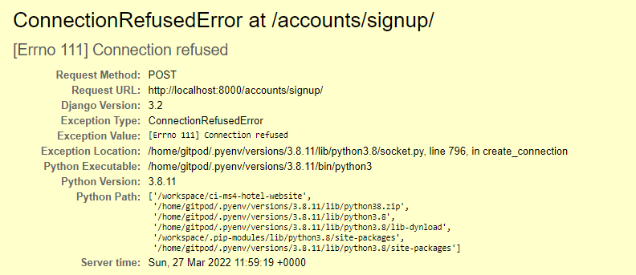

W