# Hotel Booking System with Django

## Introduction

Welcome to my fourth milestone project. In this project, I create a hotel booking system where users can register an account, book a room, and manage their bookings.  
It will use the Django framework, Python, HTML, and JavaScript languages.

This project aims to show the use of CRUD functionality (Create, Read, Update, Delete). After registering an account, the user can create, read, update and delete their hotel booking.

A live website can be found [here](https://my-hotel-project.herokuapp.com/).

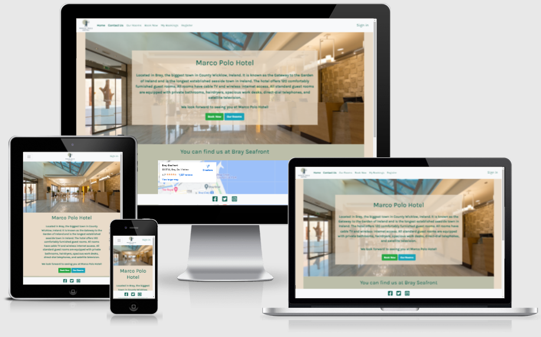

## Table of Contents

- [1 UX](#1-ux)
  - [1.1 Strategy](#1.1-strategy)
    - [Project Goals](#project-goals)
    - [User Goals](#user-goals)
    - [User Expectations](#user-expectations)
    - [User Stories](#user-stories)
    - [Scope](#scope)
      - [Phase 1](#phase-1)
      - [Phase 2](#phase-2)
  - [1.2 Structure](#1.2-structure)
    - [Data Model](#data-model)
  - [1.3 Wire-frames](#1.3-wire-frames)
    - [Mobile](#mobile)
    - [Desktop](#desktop)
  - [1.4 Surface](#1.4-surface)
    - [Colours](#colours)
    - [Typography](#typography)
- [2 Features](#2-features)
  - [All Pages](#all-pages)
  - [Home Page](#home-page)
  - [Our Rooms Page](#our-rooms-page)
  - [Book Now Page](#book-now-page)
  - [My Bookings Page](#my-bookings-page)
  - [Register page](#register-page)
  - [Sign in/out](#sign-in/out)
- [3 Technologies Used](#technologies-used)
- [4 Testing](#testing)
- [5 Development Cycle](#development-cycle)
- [6 Deployment](#deployment)
- [7 End Product](#end-product)
- [8 Known Bugs](#known-bugs)
- [9 Credits](#credits)

## 1 UX

[Go to the top](#table-of-contents)

Traveling is by far the thing that I like to do most, and a big part of the trip is about where you are staying.
When you visit a new city, you need a place to stay. The easiest way to book a hotel room is online.

This project will demonstrate how simple and easy a hotel booking system can be.

## 1.1 Strategy

[Go to the top](#table-of-contents)

### Project Goals

[Go to the top](#table-of-contents)

This project aims to allow users to register a new account, perform a sign-in and sign-out action, book a hotel room, and manage their bookings (see past and future bookings, make an update on an upcoming booking, or cancel the booking).

### User Goals

[Go to the top](#table-of-contents)

First Time Visitor Goals

- As a first-time visitor, I want to book a room for a chosen date.
- As a first-time visitor, I want to view pictures of the hotel room and prices per night.
- As a first-time visitor, I want to view information about the hotel so I can decide to book a room.
- As a first-time visitor, I want to get the hotel's contact information.

Returning Visitor Goals

- As a Returning Visitor, I want to view my bookings details.
- As a Returning Visitor, I want to update an upcoming booking.
- As a Returning Visitor, I want to cancel an upcoming booking.

Frequent User Goals

- As a Frequent User, I want to see my past bookings or book a new stay.

### User Expectations

[Go to the top](#table-of-contents)

 The following user expections were considered while designing the site:

- The menu is clear to read and navigate.
- The site structure is designed to be simple and easy to use.
- The user interface is easy to navigate.
- The website is responsive on all devices.
- All images on the website are of high quality.
- Easy to find contact information and hotel location.

### User Stories

[Go to the top](#table-of-contents)

I use GitHub kanban board to log all user stories for my project. It was an excellent tool to visualize what to focus on first.
The user stories would go directly to the "To Do" lane when created. I would move them to the "In progress" lane when working on the story, and once completed, I would move them to the "Done" lane.

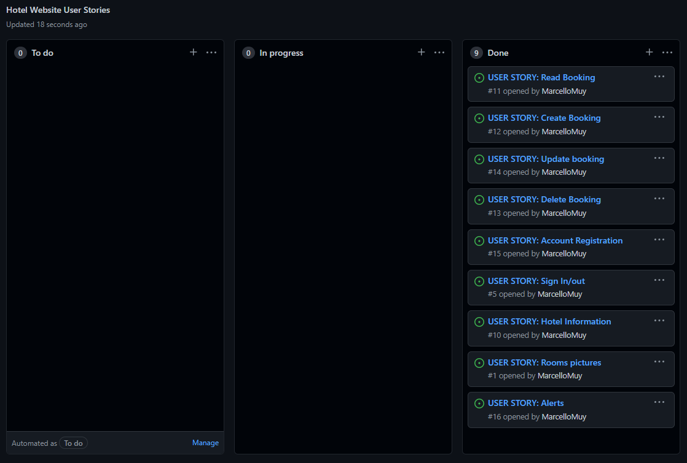

### Scope

[Go to the top](#table-of-contents)

I decided to divide this project into two phases. I include the features that I have identified as a minimum viable product in the first phase.
In the second, I included the features that I found would make a good improvement for the web application.

### Phase 1

[Go to the top](#table-of-contents)

- Display rooms pictures
- Display hotel information, including location and contact
- Allow users to register a new account
- Responsive design
- Ability to create a booking
- Ability to update a booking
- Ability to cancel a booking
- Display past bookings
- Display alerts for each step of CRUD operations

### Phase 2

[Go to the top](#table-of-contents)

- Register account email confirmation
- Email confirmation for new bookings
- Create a new Django view to confirm booking deletion instead of using a JavaScript function
- Calculate the total of the booking and display it to the user
- A button on the "Update booking" page to go back to "My Bookings" page if the user changes their mind.

## 1.2 Structure

[Go to the top](#table-of-contents)

- All pages of this project are responsive using different screen sizes. In addition, fonts and color scheme are consistent throughout all pages, guaranteeing the best user experience.
- Navbar is positioned at the top, and Footer at the bottom of all pages.
- Buttons have self-describing text for easy navigation.

### Data Model

[Go to the top](#table-of-contents)

- Planned database structure:

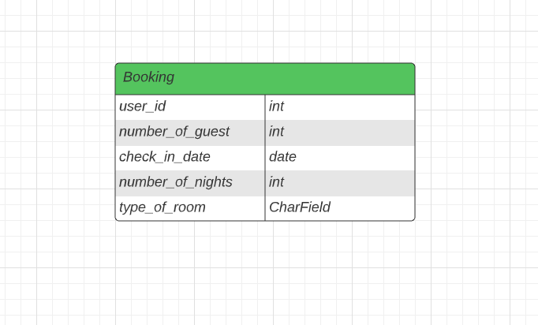

- Final database structure:

```python
class Booking(models.Model):
    ''' Model for user bookings '''
    today = date.today()
    user = models.ForeignKey(
        User, on_delete=models.CASCADE, related_name="user_bookings")
    created_on = models.DateTimeField(auto_now_add=True)
    number_of_guests = models.PositiveIntegerField(
        default=1, validators=[MaxValueValidator(15), MinValueValidator(1)])
    check_in_date = models.DateField(default=date.today)
    number_of_nights = models.PositiveIntegerField(
        default=1, validators=[MaxValueValidator(30), MinValueValidator(1)])
    TYPE_OF_ROOM_CHOICES = [
        ('Twin', 'Twin Room'),
        ('Double', 'Double Room'),
        ('Family', 'Family Room'),
    ]
    type_of_room = models.CharField(
        max_length=15,
        choices=TYPE_OF_ROOM_CHOICES,
        blank=False,
        default='Double'
        )

    ''' Display objects using the check-in date'''
    def __str__(self):
        return str(self.check_in_date)

    class Meta:
        """ Meta class used for organizing bookings by check-in date """
        ordering = ['check_in_date']
```

## 1.3 Wire-frames

[Go to the top](#table-of-contents)

### Mobile

Home Page mobile:

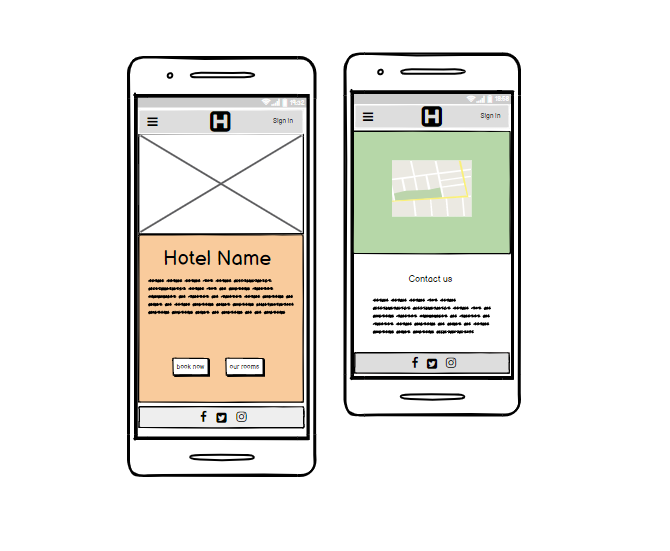

Our Rooms Page mobile:

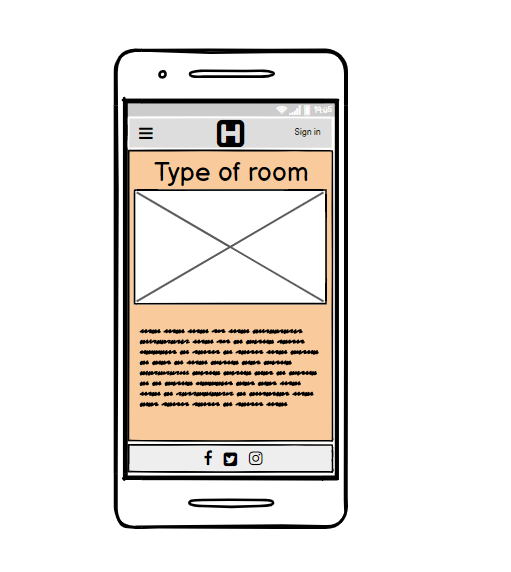

My bookings Page mobile:

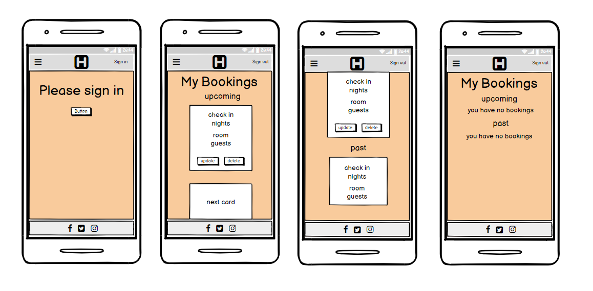

Book Now Page mobile:

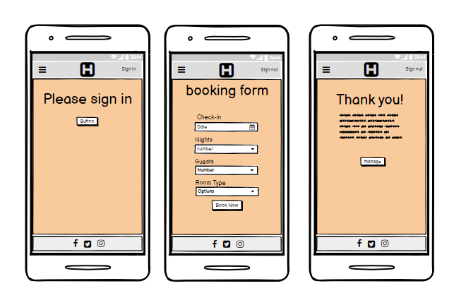

Sign in/out and Register Page mobile:

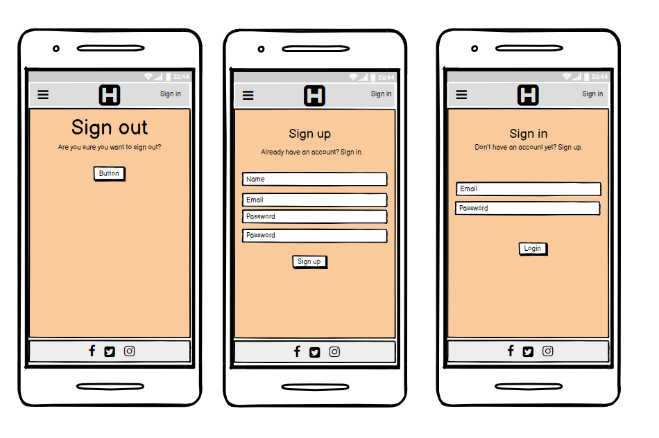

### Desktop

[Go to the top](#table-of-contents)

Only the index page and my bookings page have a difference in design compared to the mobile version.

Index Page desktop top:

The index page has a bigger hero image covering most of the page, a margin on both sides of the page, and the hotel info is displayed on top of the hero image.

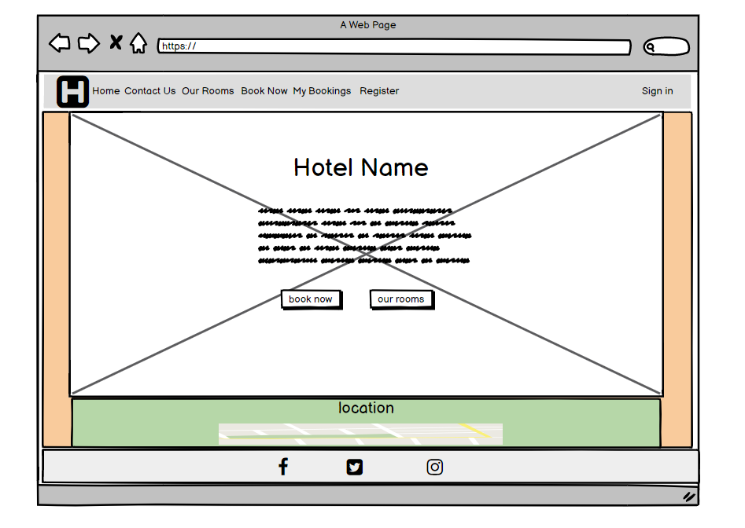

Index Page desktop bottom:

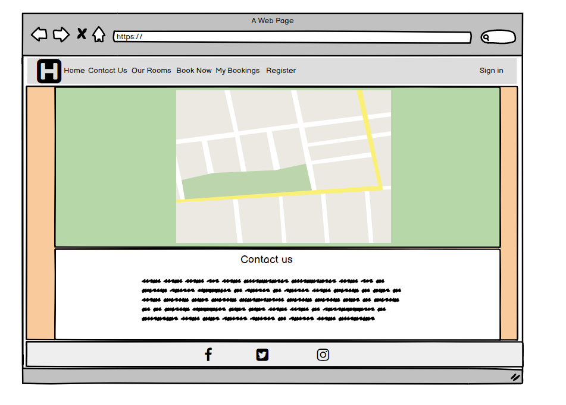

My Bookings Page desktop:

My bookings page displays booking cards in rows of up to four cards.

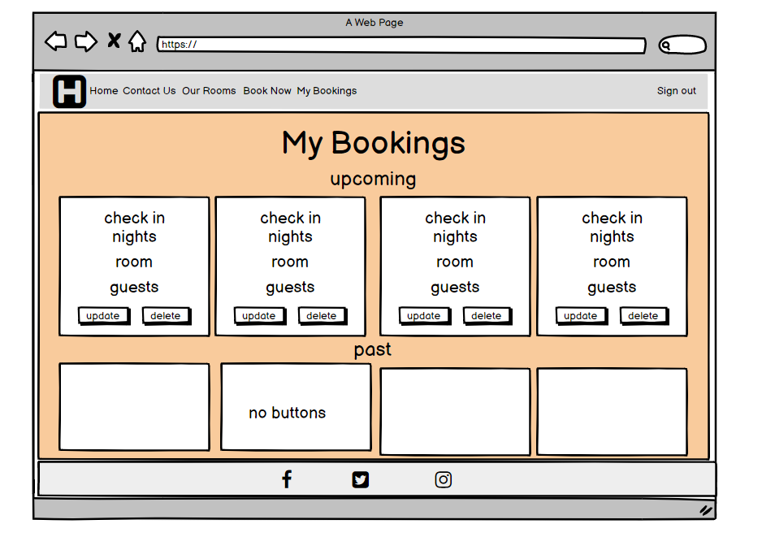

## 1.4 Surface

[Go to the top](#table-of-contents)

### Colours

I used ColorSpace to generate this colour scheme.

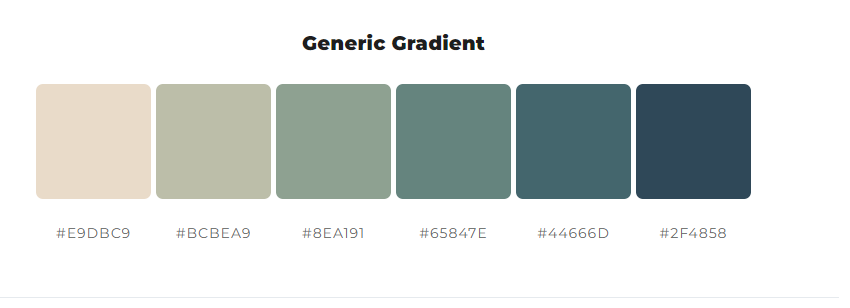

The following colors were used to design this website:

- #E9DBC9
- #005B4B
- #e9dbc9c9
- #BCBEA9
- #f8f9fa

### Typography

[Go to the top](#table-of-contents)

I decided to use Google fonts "Karla" for all pages with "Sans Serif" as the backup font.

Google fonts link [here](https://fonts.google.com/specimen/Karla?query=karla)

## Features

[Go to the top](#table-of-contents)

### All Pages

Navigation bar:

- Is placed at the top of the screen at all times
- If the user is logged in, the "Sign-in" link will change to "Sign out" and the "Register" link will disappear.
- The link in the navbar will have a class attribute to show as active when the user is the specific page. The "Home" and "Contact US" links will be activated together as both links belong to the same page but in different sections.
- The restaurant logo works as a link for the home page.
- In the mobile version, the logo is positioned at the center of the navbar, and a hamburger icon is placed on the left.
- All links are displayed when the hamburger icon is clicked, as shown below.

Navbar Logged:

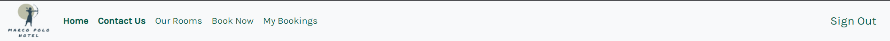

Navbar not Logged:

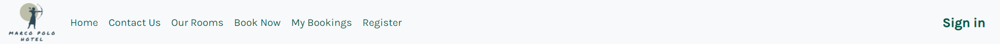

Navbar showing "Our Rooms" link active:


Navbar mobile:


Navbar hamburger icons mobile:


Footer:

- The footer is placed at the bottom of the screen at all times.
- It has three social links placed at the center of the page that opens in a new page.

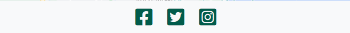

### Home Page

[Go to the top](#table-of-contents)

- The Home page has a short description of the hotel and two action buttons.
- A button for booking a room and a button that will send the user to the "Our Rooms" page, where they can see information and pictures of the rooms.
- For larger screens the hotel information is displayed inside a container on top of the hero image to increase readability.

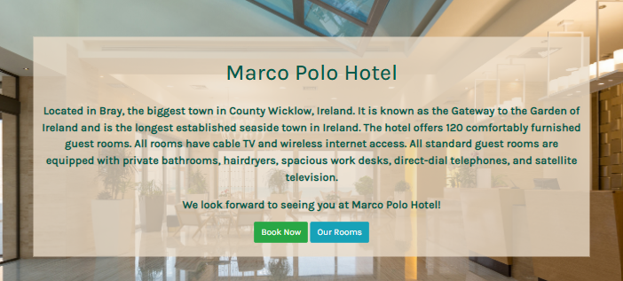

- Below the hero image, you can find an iframe containing the google maps location of the hotel.

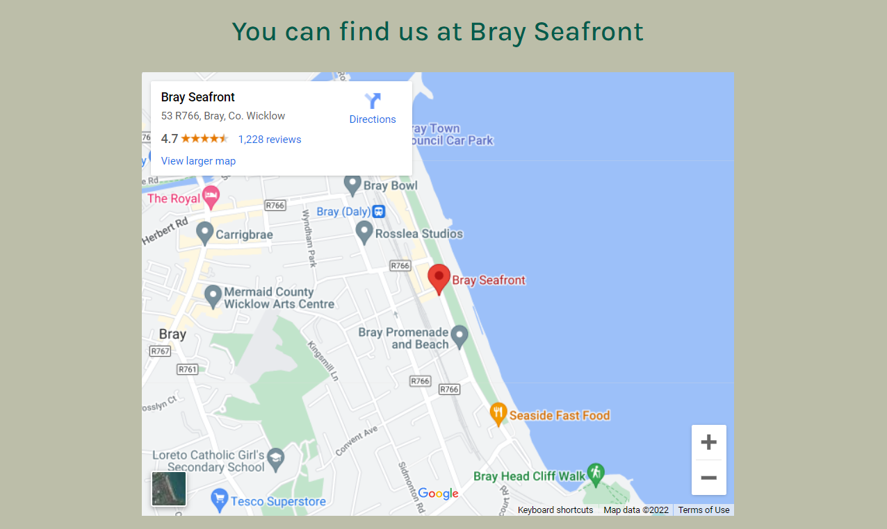

- At the bottom of the page, you can find the hotel's contact information: address, email and phone number.

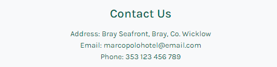

### Our Rooms Page

[Go to the top](#table-of-contents)

- On the "Our Rooms" page, you will find pictures of the three types of rooms the hotel has: Double Room, Twin Room and Family Room.
- Under each picture, there is the price per night for the room and a short description of the room.

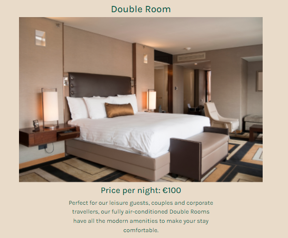
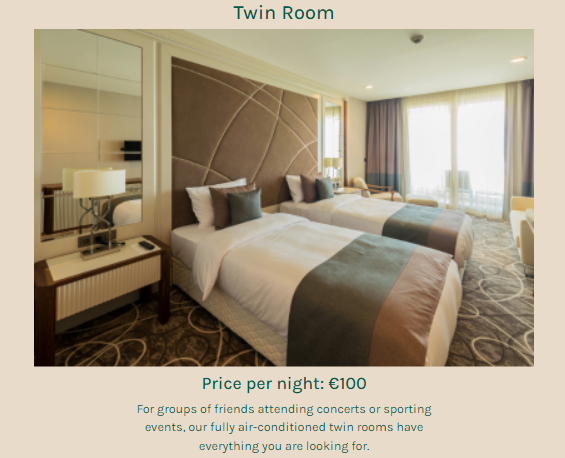
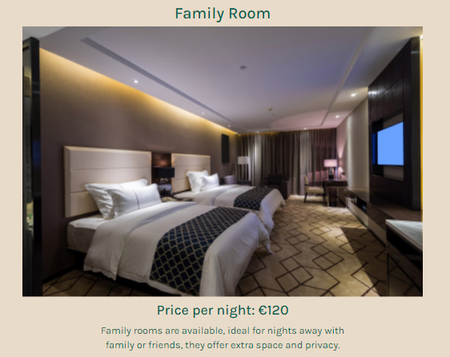

### Book Now Page

[Go to the top](#table-of-contents)

- If the user is not logged in, a call for sign-in is displayed on the page.

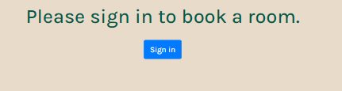

On the "Book Now" page, the user will be asked to fill up a form with:

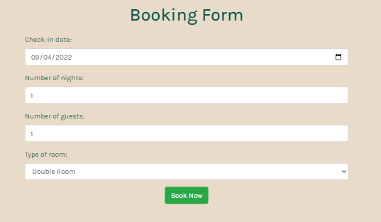

- Check-in date (date must be for the next day onwards)
- Number of nights (up to 30 nights)
- Number of guests (up to 15 guests)
- Type of room (Choose between double, twin or family rooms)
- When clicking the "Book Now" button thank you page will be displayed.
- On the "thank you" page, the user can find a button to manage bookings.

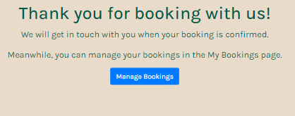

- An alert error message will show if the user inserts any invalid information.

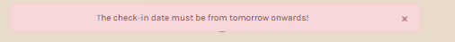
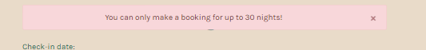
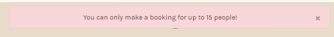

### My bookings Page

[Go to the top](#table-of-contents)

- If the user is not logged in, a call for sign-in is displayed on the page.

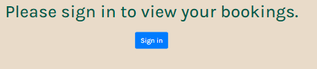

On the "My bookings" page, the bookings are separated into two categories: Upcoming and Past.

- If the user has no bookings, a message is displayed instead of the cards.

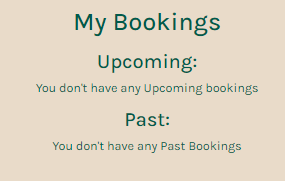

- For upcoming bookings, the card will have two buttons at the bottom for updating and deleting the booking.
- The cards are ordered by the nearest check-in date.

Bookings will be displayed in rows of up to four cards, depending on the screen size.
Each booking is displayed on a card containing:

- Check-in date
- Number of Nights
- Room Type
- Number of Guests


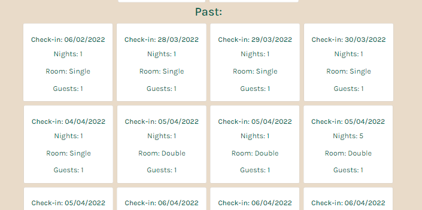

- If the user clicks on the "Update" button, the "Update Booking" page will show containing a form to update the booking.

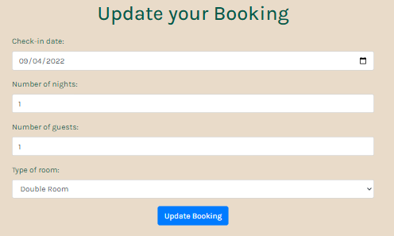

- An alert will show when the update is done.

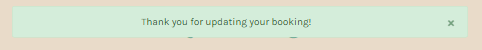

- If the user clicks on the "Cancel" button, a JavaScript onclick function will be called, and a popup to confirm the cancellation will show.


- An alert will show when the cancelation is done.

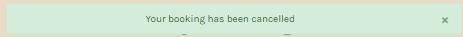

### Register Page

[Go to the top](#table-of-contents)

On the registration page, the user will need to fill up a form containing:

- Username
- Email(optional)
- password
- password(again)

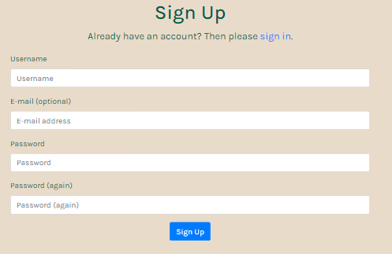

When clicking the sign-up button, two alerts will show.

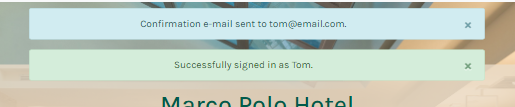

Because this project doesn't have an e-mail confirmation management system yet.
This line of code was added to settings.py.

```python
EMAIL_BACKEND = 'django.core.mail.backends.console.EmailBackend'
```

The e-mail confirmation is handled in the console, as seen below.

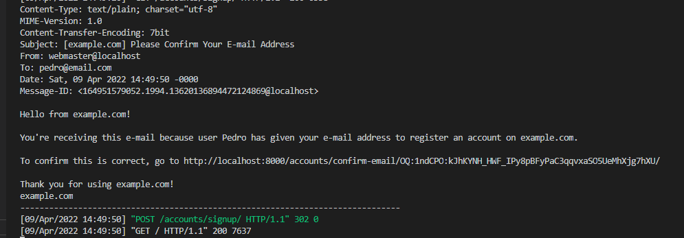

### Sign in/out

[Go to the top](#table-of-contents)

On "Sign in" page, the user will need to fill up a form containing:

- Username
- Password

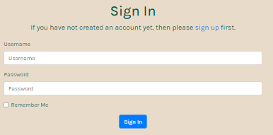

An alert will show once the sign-in is completed.

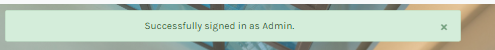

If the user clicks on the sign-out link in the navigation bar, the "Sign out" page will be displayed.

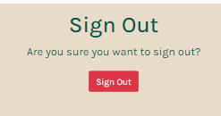

If the user confirms the sign-out, an alert will show.

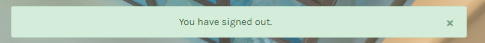


## Installed frameworks and libraries

- Django 3.2 (framework)
- Gunicorn (to run server on heroku)

- Dj_database_url (library)
- Psycopg2 (library to connect to PostgreSQL)
- Cloudinary (library to host pictures on Heroku)
- django-allauth (library used for authentication and registration)
- django-crispy-forms (library used to format forms)
- whitenoise (Allows web app to serve its own static files)
